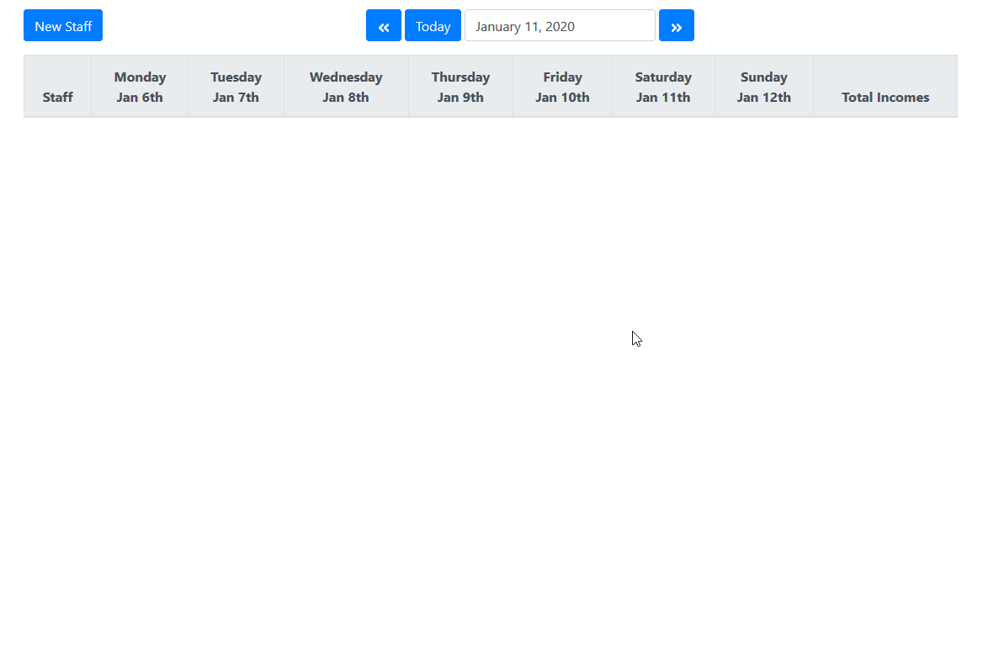

# Your Staff
It will help you manage the incomes of your staff. The idea comes from my sister because she needs an application to caculate the amount for payroll.


## Run it locally
1. Clone this project
2. Install dependencies
```
npm install
```
3. Start the application
```
npm start
```

You should run with backend of this application

## Demo
You can run a demo [here](https://calm-badlands-74911.herokuapp.com/)
